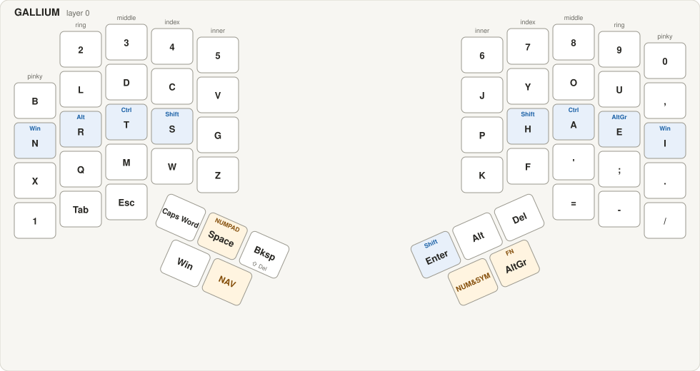
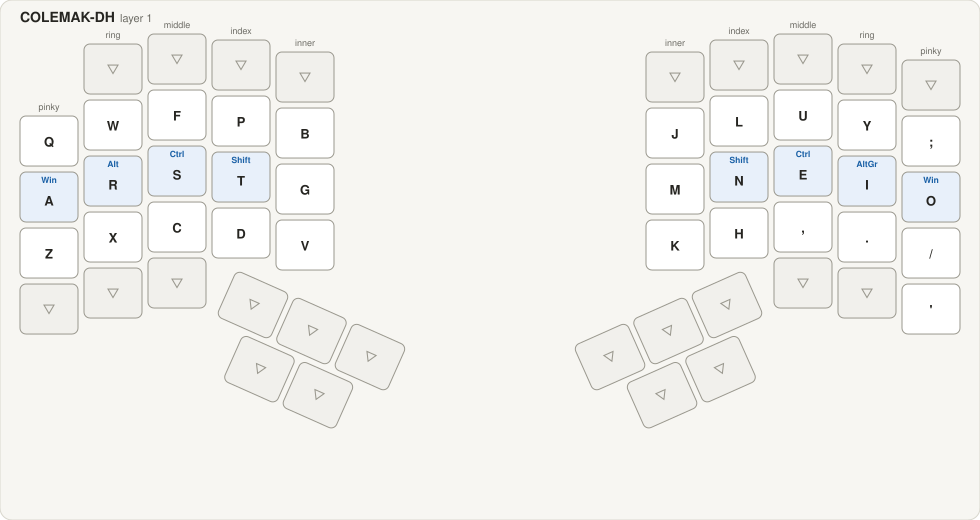
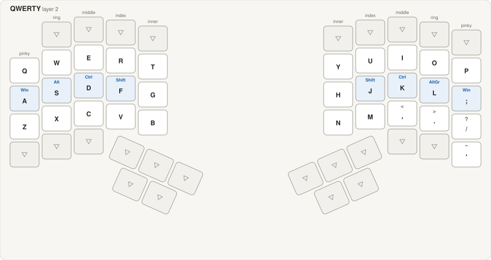
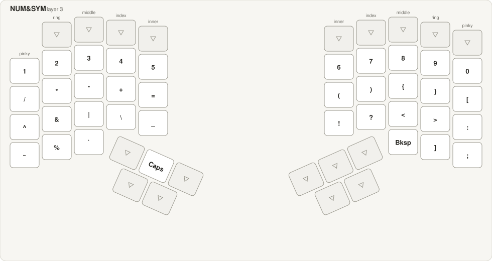
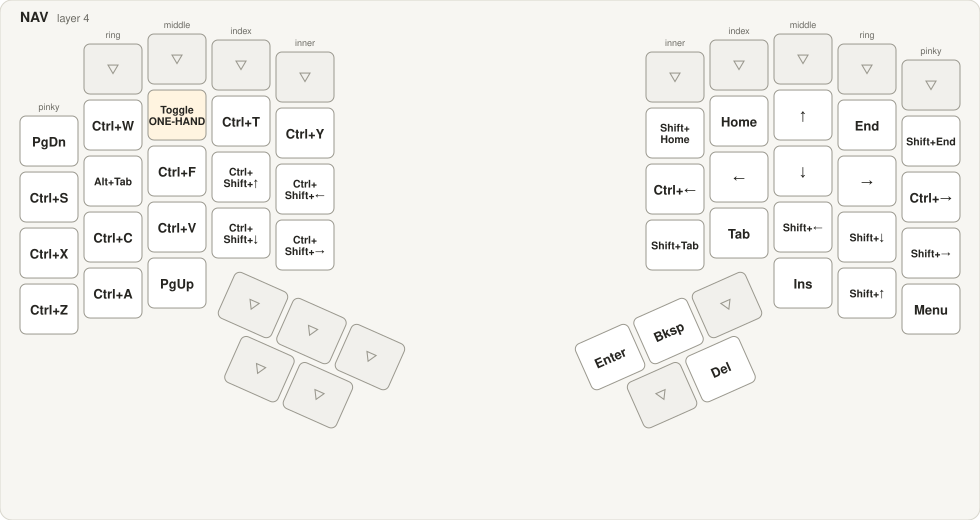
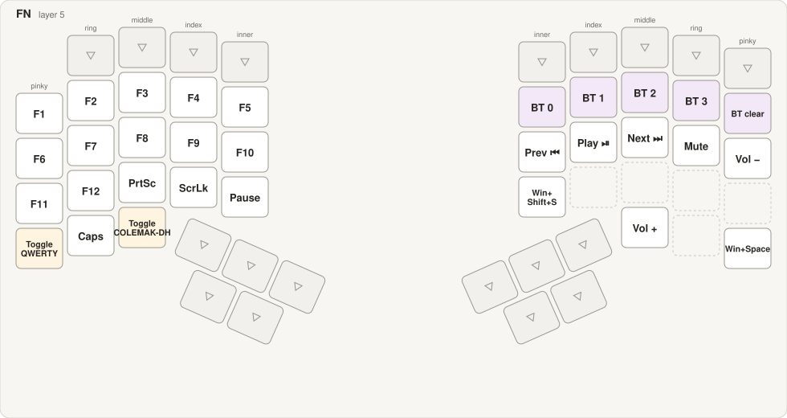
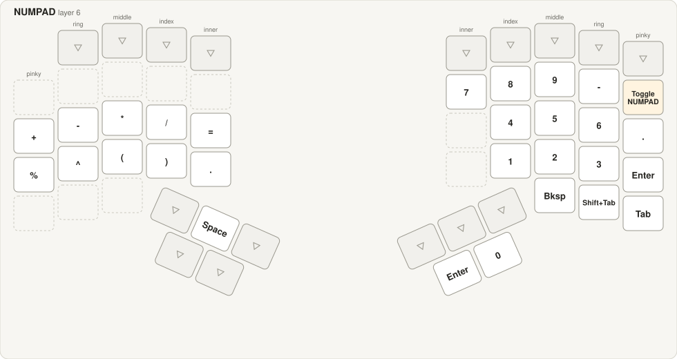
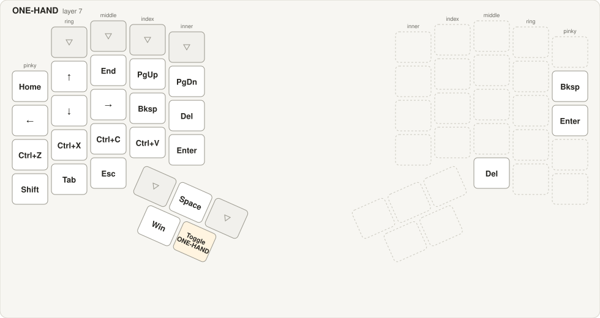
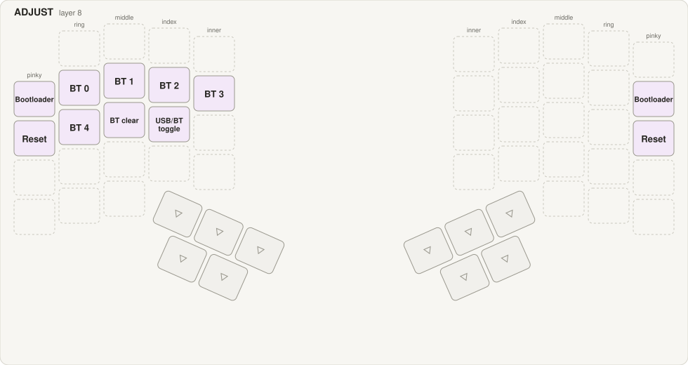

# Dactyl Manuform (Cosmos, handwired) — ZMK config

Split 55-key Dactyl Manuform 5x6, hand-wired, two SuperMini nRF52840 boards
(nice!nano v2 compatible), ZMK v0.3.0. Left half is the Bluetooth central,
right half is the peripheral. Base layer is Gallium with home-row mods;
Colemak-DH and QWERTY are available as toggles.

## Building and flashing

1. Push to this repo. GitHub Actions builds the firmware (see `build.yaml`),
   about three minutes. Download `firmware.zip` from the run's artifacts.
2. Put a half into bootloader: double-tap its reset button. A drive called
   `NICENANO` appears.
3. Copy the matching `.uf2` onto the drive. The board reboots by itself.
   - `dactyl_manuform_5x6_left-nice_nano_v2-zmk.uf2` for the left half
   - `dactyl_manuform_5x6_right-nice_nano_v2-zmk.uf2` for the right half
   - the `*_LOG.uf2` builds are the same firmware with USB logging on a
     serial port, for debugging. They use more battery.
   - `settings_reset-nice_nano_v2-zmk.uf2` wipes bonds and settings.

Only the left half shows up as a keyboard on USB. The right half never types
over USB, it only charges there; Windows lists it as "TAIKO-DACTYL-R" with a
driver error (Code 28), which is normal for a ZMK peripheral.

## Hardware notes

- The boards **do** have a 32 kHz crystal. The firmware must use it
  (`CONFIG_CLOCK_CONTROL_NRF_K32SRC_XTAL=y`). With the RC oscillator every
  Bluetooth link timed out at pairing; with the synthesized clock the halves
  paired but the split link dropped every few seconds once the right half
  started sleeping between connection events (diagnosed 2026-10-03 over the
  USB logs of both halves).
- TX power is set to +8 dBm because the SuperMini chip antenna is weak.
- Wiring: see `dactyl-wiring-diagram.html` (col2row diode matrix, 6 columns
  x 5 rows per hand).

## Bluetooth recovery

- **Host says "couldn't connect" after you removed the keyboard on that
  side.** The left half still holds the old bond. Hold FN (right inner
  middle-row thumb) and press the right pinky key on the top row (BT clear),
  then pair again from the host.
- **Halves stop seeing each other** after a settings reset on one half only:
  flash `settings_reset` to both halves, then the left and right firmware,
  and power both on together.
- Profiles: FN layer top row on the right hand selects profile 0 to 3;
  ADJUST (hold NAV + NUM) has profile 4, BT clear, USB/BT output toggle,
  bootloader and reset.

## Keymap

Regenerate this section and `docs/keymap.html` after any keymap change:

```
node tools/keymap-html.js
```

<!-- keymap:start — generated by tools/keymap-html.js, do not edit by hand -->
_Generated 2026-10-03 from `config/dactyl_manuform_5x6.keymap`. Small blue text = modifier while held, small amber text = layer while held, ▽ = falls through to the base layer, dashed = nothing. Blue keys are home-row mods, amber keys change layer, purple keys are Bluetooth and system. One page with all layers: [docs/keymap.html](docs/keymap.html)._

### GALLIUM (layer 0)



### COLEMAK-DH (layer 1)



### QWERTY (layer 2)



### NUM&SYM (layer 3)



### NAV (layer 4)



### FN (layer 5)



### NUMPAD (layer 6)



### ONE-HAND (layer 7)



### ADJUST (layer 8)



### Combos (base layer)

| Output | Keys (Gallium) | Note | Window |
|---|---|---|---|
| Esc | C + D | C + D | 40 ms, after 150 ms idle |
| Tab | D + L | D + L | 40 ms, after 150 ms idle |
| Caps Word | R + E | R + E | 40 ms, after 150 ms idle |
| Del | U + , | U + , | 40 ms, after 150 ms idle |
| Win+Shift+S | Q + X | Q + X | 40 ms, after 150 ms idle |
| ( | T + R | T + R | 40 ms, after 150 ms idle |
| ) | E + A | E + A | 40 ms, after 150 ms idle |
| { | L + B | L + B | 40 ms, after 150 ms idle |
| } | O + U | O + U | 40 ms, after 150 ms idle |
| [ | M + Q | M + Q | 40 ms, after 150 ms idle |
| ] | ' + ; | ' + ; | 40 ms, after 150 ms idle |
<!-- keymap:end -->
